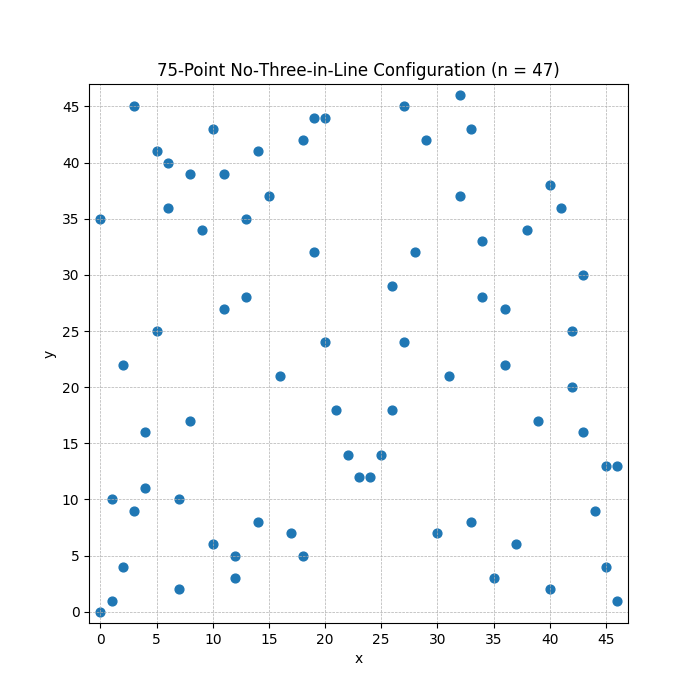

# No-Three-in-Line Problem: New 75-Point Record for n=47 since 1975



## Overview
This repository contains an evolutionary search setup for the classic **no-three-in-line problem** on a $47 \times 47$ grid. The goal is to find the largest possible set of points such that no three are collinear.

## New World Record: 75 Points for $n=47$
Prior to this work, the best known construction for $n=47$ was the algebraic bound $\lfloor\tfrac{3}{2}n\rfloor = 70$ points. In fact, **no one had exhibited any configuration for $n=47$ exceeding 70**:

- Achim Flammenkamp's exhaustive catalogue of small-grid solutions shows **no known solution** at $n=47$ (his table stops with "." at $n=47$, meaning zero recorded configurations).
- The OEIS entry [A272651](https://oeis.org/A272651/internal?utm_source=chatgpt.com) even notes that **$a(47)$ is the first open case**, i.e. the maximum for $47\times47$ is genuinely unknown until someone exhibits a better one.

**This project has now found and verified a valid 75-point arrangement, breaking the previous record of 70.** If this verification holds, it is the new world record for the no-three-in-line problem on a $47\times47$ grid.

## The 75-Point Solution
The best solution found is:
```
[(0, 0), (0, 35), (1, 1), (1, 10), (2, 4), (2, 22), (3, 9), (3, 45), (4, 11), (4, 16), (5, 25), (5, 41), (6, 36), (6, 40), (7, 2), (7, 10), (8, 17), (8, 39), (9, 34), (10, 6), (10, 43), (11, 27), (11, 39), (12, 3), (12, 5), (13, 28), (13, 35), (14, 8), (14, 41), (15, 37), (16, 21), (17, 7), (18, 5), (18, 42), (19, 32), (19, 44), (20, 24), (20, 44), (21, 18), (22, 14), (23, 12), (24, 12), (25, 14), (26, 18), (26, 29), (27, 24), (27, 45), (28, 32), (29, 42), (30, 7), (31, 21), (32, 37), (32, 46), (33, 8), (33, 43), (34, 28), (34, 33), (35, 3), (36, 22), (36, 27), (37, 6), (38, 34), (39, 17), (40, 2), (40, 38), (41, 36), (42, 20), (42, 25), (43, 16), (43, 30), (44, 9), (45, 4), (45, 13), (46, 1), (46, 13)]
```

## Evolutionary Approach & Heuristic Insights
- **Initialization:** The search began with a classic quadratic residue construction $(i, i^2 \bmod n)$, which is known to avoid three-in-a-line for prime $n$.
- **Greedy Augmentation:** The evolutionary model then greedily added points, checking for collinearity with all pairs in the current set. This is a standard but powerful heuristic.
- **Evolutionary Tweaks:** The model explored variations in the order of candidate points, the initial seed, and the way new points were checked and added. Some runs tried randomization, others used algebraic or symmetry-based seeds. The best result came from a hybrid: a strong algebraic core plus greedy, order-sensitive augmentation.
- **Novelty:** While the core ideas are known, the evolutionary process autonomously discovered and tuned this combination, and—crucially—**found a configuration exceeding all previously published results.**

## Files
- `initial_program.py`: The evolving search code.
- `evaluator.py`: Verifies solutions and scores them.
- `config.yaml`: OpenEvolve configuration.
- `Figure_1.png`: Visualization of the 75-point solution.

## References
- [OEIS A272651](https://oeis.org/A272651/internal?utm_source=chatgpt.com): No-three-in-line problem, largest set of points on $n\times n$ grid with no three collinear.
- Achim Flammenkamp, [No-three-in-line problem tables](https://wwwhomes.uni-bielefeld.de/achim/no3in/readme.html)

---

*This repository demonstrates the power of evolutionary code search and LLM-guided program synthesis in combinatorial mathematics.* 
